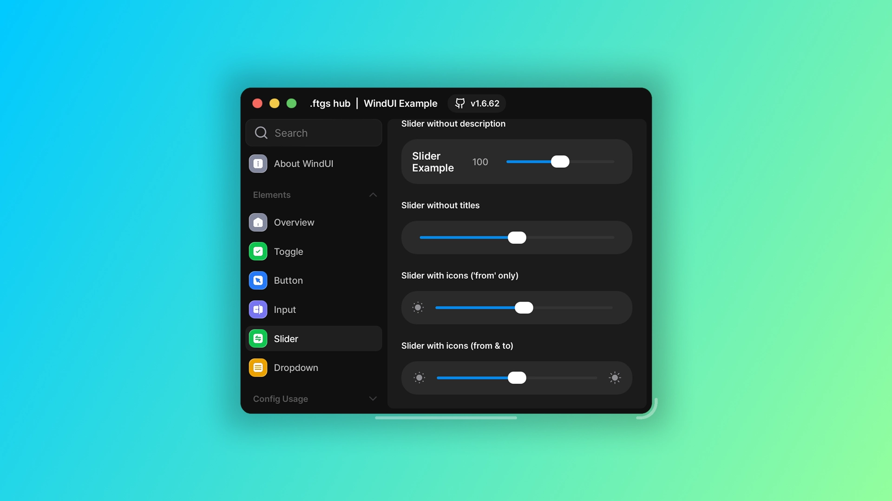

<div align="center">



# WindUI GodTier

### A premium Roblox Luau UI library for clean, cinematic, modern interfaces.

WindUI GodTier is built for developers who want their Roblox menus, script hubs, tools, dashboards, admin panels, and in-game interfaces to feel polished from the first frame. It focuses on premium visuals, smooth motion, theme flexibility, readable structure, and fast implementation.

<br />

[](https://www.roblox.com/)
[](https://luau.org/)
[](#version)
[](#about-windui-godtier)
[](LICENSE)

[](https://github.com/theentrophyenchelon-svg/WindUi/stargazers)
[](https://github.com/theentrophyenchelon-svg/WindUi/forks)
[](https://github.com/theentrophyenchelon-svg/WindUi/watchers)

</div>

---

## About WindUI GodTier

WindUI GodTier is a high-end Roblox UI framework built to make interfaces feel professional, responsive, and premium without forcing developers to build every component from scratch. It provides a complete interface layer with windows, tabs, sections, input controls, key systems, notifications, popups, acrylic visuals, theme presets, and polished interaction feedback.

This build is positioned as a top-tier Roblox UI library because it focuses on the details that usually separate average interfaces from elite ones: hierarchy, spacing, animation feel, visual contrast, hover states, responsive controls, and clean developer ergonomics.

### What makes it stand out

- **Premium visual design** — modern radius, refined borders, acrylic styling, shadows, glow options, and clean layout hierarchy.
- **Smooth interaction feel** — hover states, press states, ripple feedback, window motion, and configurable animation speed.
- **Powerful theme system** — premium presets plus custom theme creation for unique branding.
- **Complete component set** — buttons, toggles, sliders, dropdowns, inputs, keybinds, colorpickers, media elements, layout tools, notifications, dialogs, and more.
- **Roblox-first workflow** — built for Luau, Roblox Studio, Rojo-style project structure, and fast loadstring distribution.
- **Clean release structure** — source files in `src/`, compiled output in `dist/`, examples in root files, and visual assets in `docs/`.

---

## Live Repository Stats

> GitHub badge services may not show live values while this repository is private. They will update normally when the repository is public.

| Metric | Badge |
|---|---|
| Last Commit |  |
| Repository Size |  |
| Code Size |  |
| Top Language |  |
| Languages |  |
| Open Issues |  |
| Pull Requests |  |
| Contributors |  |

---

## Installation

### Load the packaged build

```luau
local WindUI = loadstring(game:HttpGet("https://raw.githubusercontent.com/theentrophyenchelon-svg/WindUi/main/dist/main.lua"))()
```

### Minimal setup

```luau
local WindUI = loadstring(game:HttpGet("https://raw.githubusercontent.com/theentrophyenchelon-svg/WindUi/main/dist/main.lua"))()

WindUI:UsePreset("GodTier")
WindUI:SetAnimationSpeed(1)
WindUI:SetReducedMotion(false)
WindUI:SetUIScale(1)

local window = WindUI:CreateWindow({
	Title = "WindUI GodTier",
	Icon = "sparkles",
	Author = "Premium Roblox UI Library",
	Theme = "Aurora",
	Size = UDim2.fromOffset(620, 500),
	Acrylic = true,
	Premium = true,
	Glow = true,
})

local mainTab = window:Tab({
	Title = "Main",
	Icon = "house",
})

mainTab:Button({
	Title = "Launch Feature",
	Desc = "Runs a premium WindUI interaction.",
	Callback = function()
		WindUI:Notify({
			Title = "WindUI GodTier",
			Content = "Feature launched successfully.",
			Duration = 3,
		})
	end,
})
```

---

## Feature Matrix

| System | Included |
|---|---|
| Window System | Premium shell, tabs, sections, topbar buttons, open button, acrylic, glow, radius controls |
| Elements | Button, Toggle, Slider, Dropdown, Input, Keybind, Colorpicker, Paragraph, Divider, Image, Video, Viewport |
| Layout | Groups, HStack, VStack, Space, Sections, scroll controls |
| Feedback | Notifications, popups, dialogs, ripple interactions, hover/press micro-interactions |
| Themes | Presets, fallback themes, custom theme registration, premium visual styles |
| Motion | Animation speed control, reduced-motion mode, premium pulse behavior |
| Build | `dist/main.lua`, DarkLua tooling, package metadata, Rojo project config |
| Examples | Loadstring example, Studio example, advanced demo window |

---

## GodTier APIs

| API | Purpose |
|---|---|
| `WindUI:SetAnimationSpeed(speed)` | Controls global animation pacing. |
| `WindUI:SetReducedMotion(enabled)` | Reduces motion-heavy visual effects for accessibility. |
| `WindUI:SetUIScale(scale)` | Applies global UI scaling. |
| `WindUI:CreateTheme(name, themeData)` | Registers a custom theme. |
| `WindUI:UsePreset(name)` | Applies a premium preset such as `GodTier`. |
| `Window:SetRadius(radius)` | Adjusts window corner radius. |
| `Window:SetPremium(enabled)` | Toggles premium window treatment. |
| `Window:Pulse()` | Plays a premium pulse interaction. |

---

## Premium Theme Presets

| Theme | Direction |
|---|---|
| `Aurora` | Bright, colorful, magical, clean, premium energy |
| `Obsidian` | Dark, glassy, sharp, high-contrast interface styling |
| `Cyber` | Futuristic neon polish with high-tech presentation |
| `Royal` | Elegant, luxury-inspired styling with elevated contrast |

---

## Project Structure

```text
WindUi/
├── .github/workflows/       # Build, pull request, and release automation
├── build/                   # DarkLua and packaging scripts
├── dist/                    # Compiled distributable output
│   └── main.lua             # Primary loadstring target
├── docs/                    # Visual assets, banners, previews, and branding
├── src/                     # Main Luau source
│   ├── components/          # Windows, popups, search, notifications, UI internals
│   ├── config/              # Configuration modules
│   ├── elements/            # Public UI element modules
│   ├── modules/             # Creator, icons, localization, syntax highlighter
│   ├── server/              # Server-side helper integrations
│   ├── themes/              # Theme engine and fallbacks
│   └── utils/               # Acrylic, services, and shared utilities
├── tests/                   # Stress and rendering examples
├── main.lua                 # Studio/local example
├── main.client.lua          # Advanced client demo
├── main_example.lua         # Hosted example loader
├── package.json             # Project metadata and scripts
└── GODTIER_UPGRADE.md       # Premium upgrade notes
```

---

## Development

Install dependencies:

```bash
npm install
```

Build the distributable file:

```bash
npm run build
```

Run development build mode:

```bash
npm run dev
```

Run live build mode:

```bash
npm run live-build
```

---

## Roadmap

- [x] Premium README and repository presentation
- [x] Extracted source and distribution files
- [x] GodTier build notes
- [x] Cleaned duplicate uploaded archive
- [x] Cleaned duplicate example loader
- [ ] Public documentation pass
- [ ] Full visual preview gallery
- [ ] API reference examples for every component
- [ ] Demo Roblox place using the full GodTier theme stack
- [ ] Automated release tagging

---

## Version

```text
1.7.0-godtier
```

---

## Credits

WindUI includes or references icon inspiration and assets from high-quality icon systems:

- [Lucide Icons](https://github.com/lucide-icons/lucide)
- [Craft Icons](https://www.figma.com/community/file/1415718327120418204)
- [Geist Icons](https://vercel.com/geist/icons)
- [Solar Icons](https://icones.js.org/collection/solar)
- [SF Symbols](https://sf-symbols-one.vercel.app/)

Original WindUI ecosystem references:

- [Documentation](https://footagesus.github.io/treehub-web/docs/windui)
- [Installation](https://footagesus.github.io/WindUI-Docs/docs/installation)
- [Discord Server](https://discord.gg/ftgs-development-hub-1300692552005189632)

---

<div align="center">

## WindUI GodTier

### Premium Roblox UI. Clean API. Elite presentation.

Built for interfaces that deserve to look finished.

</div>
